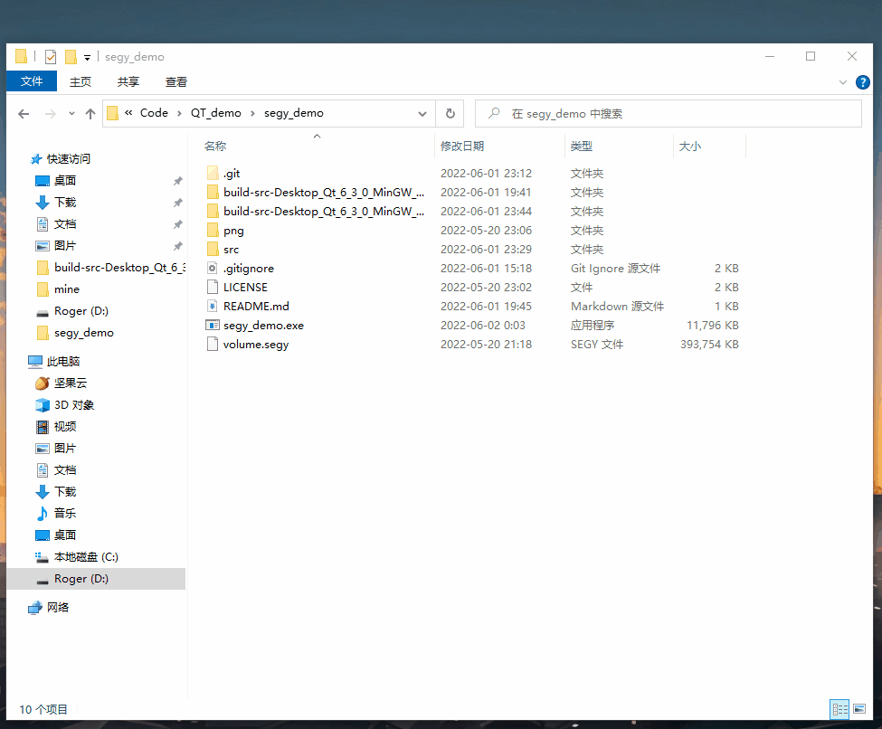
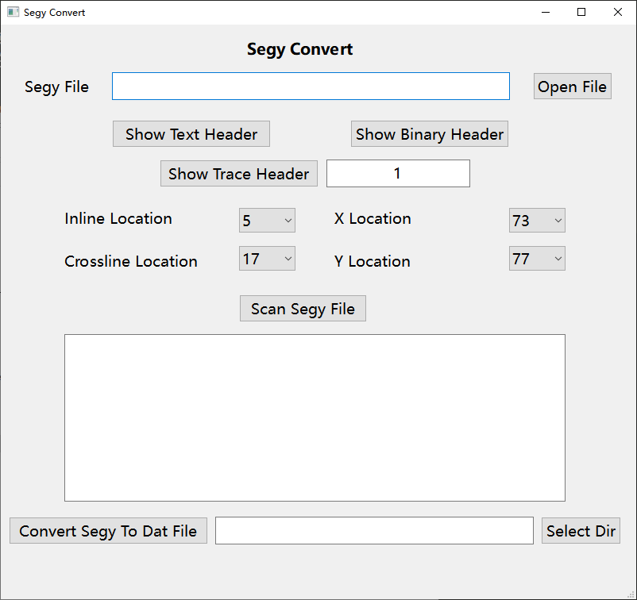
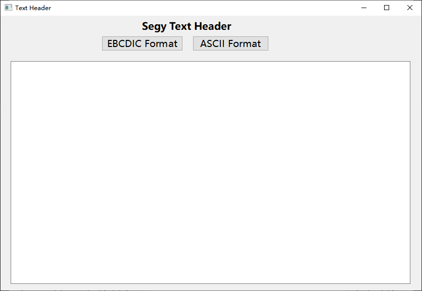
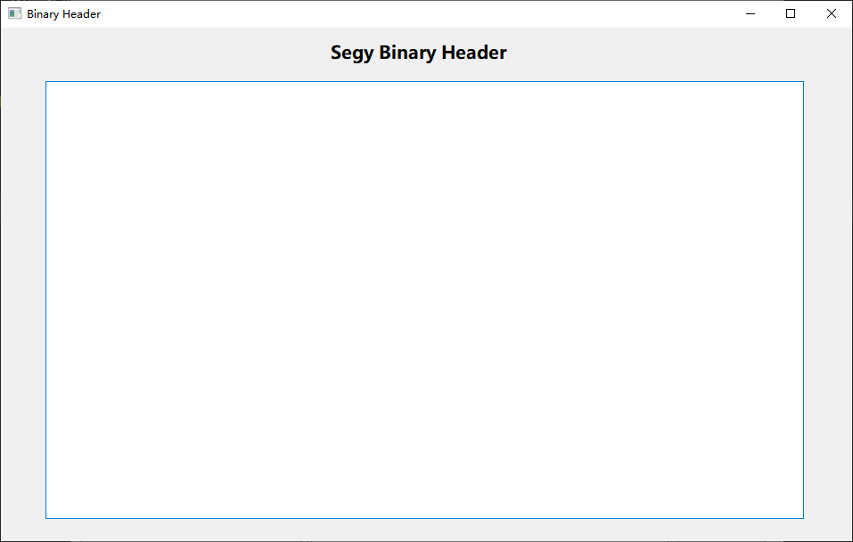
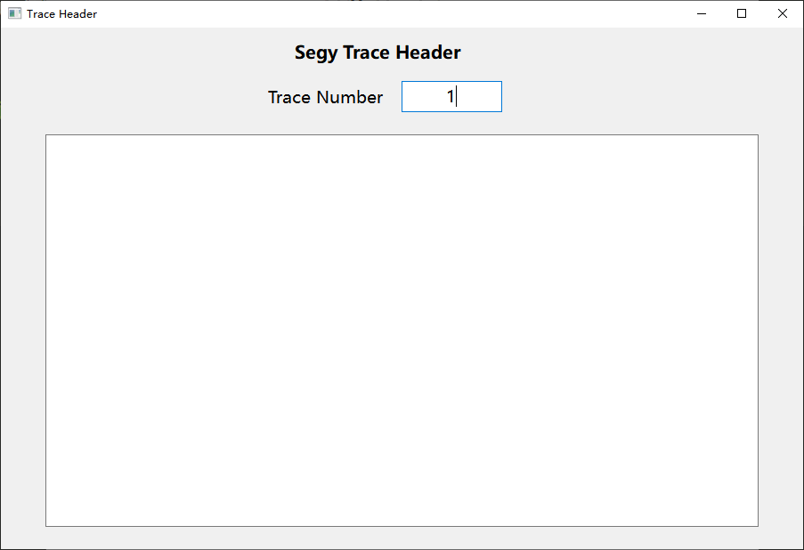

# segy_demo

一个将 3D 的 segy 文件转为 3D 的二进制文件的转换器，包括查看 3200 字节的文本道头、
二进制道头、每一道的道头，扫描文件的整体信息等功能。

此项目基于 `c++ & QT6`。

#### 使用样例

#### 整体界面

**主界面**

**3200 字节文本道头窗口**

**二进制道头窗口**

**道道头(trace header)窗口**

#### TODO

 - [x] 完成 segy 文件到二进制文件
 - [ ] 扫描出道间距，即 inline 和 crossline 方向两道直接的间距
 - [ ] 添加进度条 (Scan Segy File & Convert Segy To Dat File)
 - [ ] 完成 二进制文件 到 segy 文件的转换